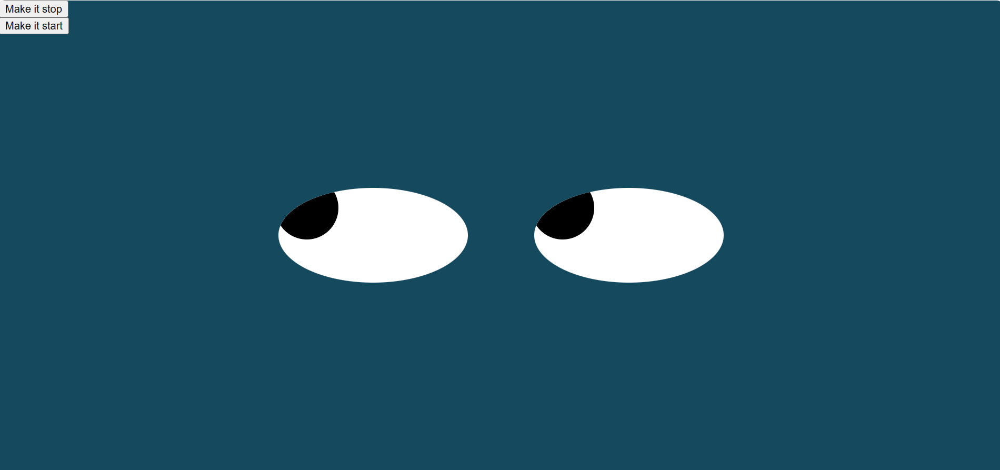

# Eye_Movement

## Description 
 A dynamic web page with two eyes that follow your mouse movement.
 The two buttons located on the left top corner of the page can stop the tracking 
 or start it.
            
 ## How to Run 
 1. create a folder to hold all the project files
 2. fork the repository
 3. makes sure all the files are in the same  folder
 4. select the html file and righ click it and select open
    
 ## Roadmap of future improvements
 Future impovements can be adding a button to get the eyes crossed and to make the page responsive. 
 
 ## License information
 <a href="https://github.com/Shushu2023/Real_Time_Bus_Tracking/edit/main/LICENSE">click here to view lience information</a>
 
